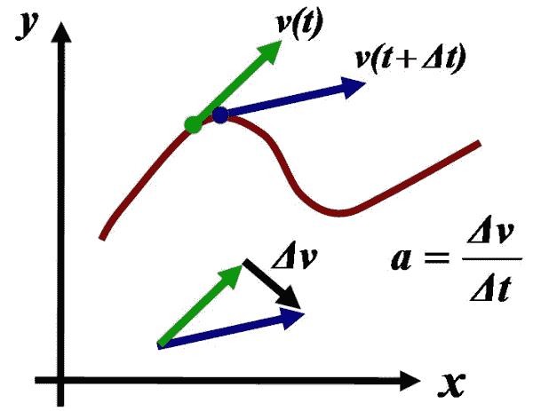
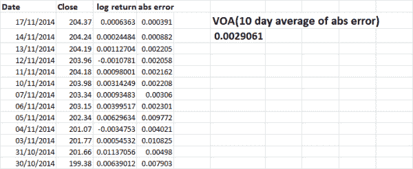
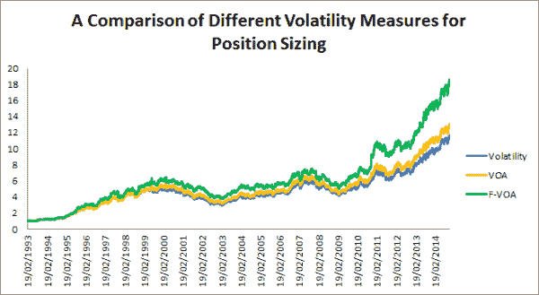
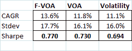

<!--yml
category: 未分类
date: 2024-05-12 17:50:46
-->

# Volatility of Acceleration Part Two | CSSA

> 来源：[https://cssanalytics.wordpress.com/2014/12/01/volatility-of-acceleration-part-two/#0001-01-01](https://cssanalytics.wordpress.com/2014/12/01/volatility-of-acceleration-part-two/#0001-01-01)

In the [last post](https://cssanalytics.wordpress.com/2014/11/28/a-new-better-measure-of-risk-and-uncertainty-the-volatility-of-acceleration/ "A New (Better?) Measure of Risk and Uncertainty: The Volatility of Acceleration"), I introduced a different method for accounting for risk or uncertainty based on the acceleration in daily returns. Another way to think about this measure is that it takes into account the average error in using yesterday’s return to forecast today’s return. An application using errors to create better trend-following indicators was discussed in “[Error-Adjusted Momentum](https://cssanalytics.wordpress.com/2014/07/30/error-adjusted-momentum/ "Error-Adjusted Momentum").” A lot of questions and comments on the last post related to the specific calculation of the volatility of acceleration (VOA). The answer is that it is a general concept, and the specific calculation can be done many different ways. But to narrow things down, I will present one way that I think is the most stable and discuss how this concept can be extended further.

**VOA= average of: | ln(pt/pt-1)- ln(pt-1/pt-2) |…….. | ln(pt-n/pt-n-1)|**

Essentially the VOA is the average of the absolute value of the first difference of daily log returns. Here is a spreadsheet picture to help clarify this basic calculation:

Here is an alternative framework called “Forecast VOA” that incorporates the change in VOA between today and yesterday to give the indicator even less lag than the original VOA:

**Forecast VOA (F-VOA)= VOA(t)+ k*(VOA(t)- VOA(t-1))**

where “k” is a constant between 0 and 1 that is selected either manually or via optimization. The lag does not need to be 1 day, but can be any number of chosen days backward. The constant k and the number of lags can incorporated as an independent or recursive process similar to an EMA where the previously solved measure is fed back into the next time step. In the following example I used the “Forecast VOA” on the S&P500(SPY) with a lag of one and a “k” value equal to one. I used a 10-day lookback for the baseline VOA and did not use recursion. The target VOA was set at 1%, where the position size is calculated as the % target divided by VOA. To make a comparison to standard volatility position-sizing, I used a 10-day lookback and computed the 20-day rolling hedge ratio between 10-day VOA and 10-day volatility on a walk-forward basis and multiplied that by the % target to normalize. Here are the results:

Both the forecast VOA, and the standard VOA outperform using standard volatility on a return and risk-adjusted (sharpe) basis. Readers will find that the standard VOA typically outperforms using standard volatility across a range of lookbacks from short to long-term on the S&P500\. However, shorter-term measures that are less than 10-days are typically too noisy to use since they contain first differences. Using the Forecast VOA seems to outperform VOA, with the caveat that at the very least one would need to solve for the parameter “k” to calibrate the model. More ambitious formulations would solve for both “k” and the optimal lag, and possibly include other terms in the equation. At this point, further research needs to be done on other instruments as suggested by one of the readers- but using a framework like F-VOA can permit adaptation to enhance performance and consistency across markets. The VOA framework is one step in the direction of looking at alternative and possibly better measures of volatility. However, there are some very sophisticated econometric methods such as GARCH to forecast volatility that readers are strongly encouraged to explore as well.