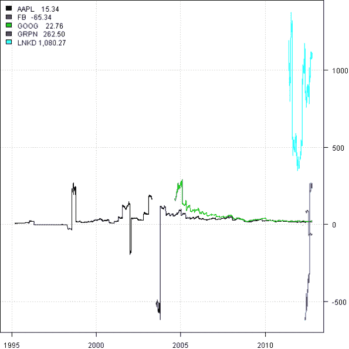
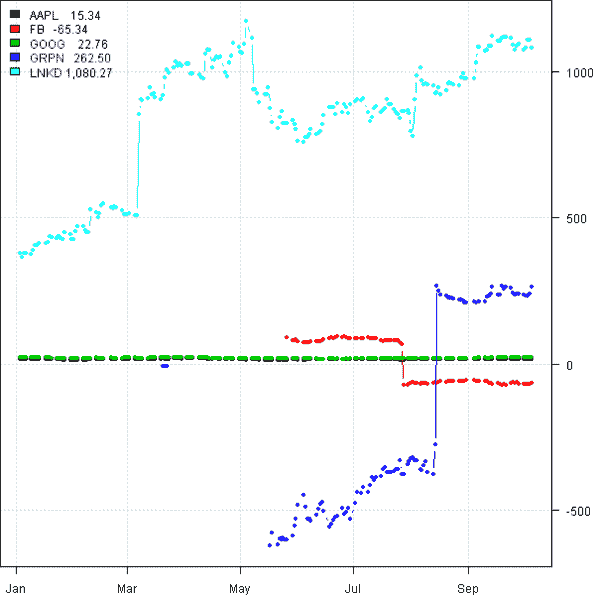
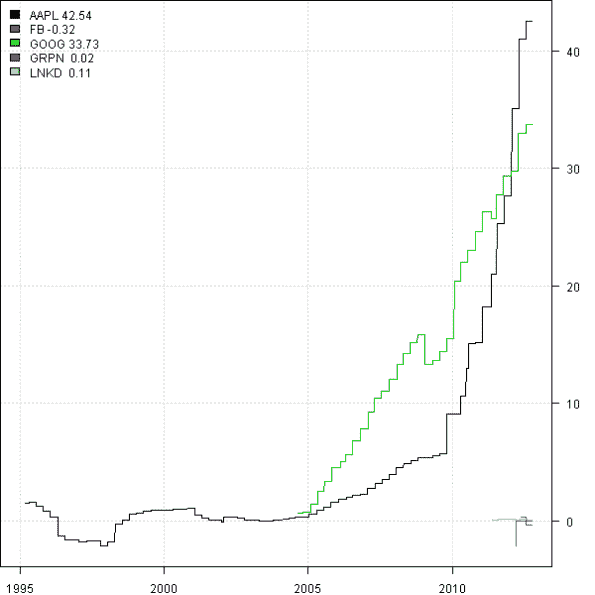
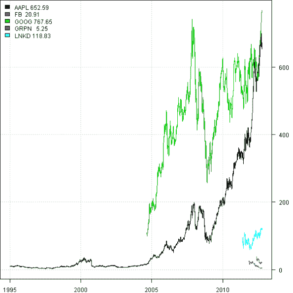

<!--yml
category: 未分类
date: 2024-05-18 14:36:49
-->

# Weekend Reading – Facebook’s P/E ratio | Systematic Investor

> 来源：[https://systematicinvestor.wordpress.com/2012/10/07/weekend-reading-facebooks-pe-ratio/#0001-01-01](https://systematicinvestor.wordpress.com/2012/10/07/weekend-reading-facebooks-pe-ratio/#0001-01-01)

The Barron’s article [Still Too Pricey by Andrew Bary](http://online.barrons.com/article/SB50001424053111904706204578002652028814658.html) looks at the share price of the Facebook and based on the P/E ration valuation metrics concludes that even at the current prices, stock is overvalued. I want to show how to do this type of fundamental analysis using the [Systematic Investor Toolbox](https://systematicinvestor.wordpress.com/systematic-investor-toolbox/).

First let’s load historical prices and earnings per share (EPS) for Facebook and a few stocks in the technology sector: LinkedIn, Groupon, Apple, and Google.

```

###############################################################################
# Load Systematic Investor Toolbox (SIT)
# https://systematicinvestor.wordpress.com/systematic-investor-toolbox/
###############################################################################
setInternet2(TRUE)
con = gzcon(url('http://www.systematicportfolio.com/sit.gz', 'rb'))
    source(con)
close(con)

	#*****************************************************************
	# Load historical fundamental and pricing data
	#****************************************************************** 
	load.packages('quantmod') 
	tickers = spl('FB,LNKD,GRPN,AAPL,GOOG')
	tickers.temp = spl('NASDAQ:FB,NYSE:LNKD,NASDAQ:GRPN,NASDAQ:AAPL,NASDAQ:GOOG')

	# get fundamental data
	data.fund <- new.env()
	for(i in 1:len(tickers)) {
			cat(tickers[i],'\n')
			data.fund[[tickers[i]]] = fund.data(tickers.temp[i], 80)
	}

	# get pricing data
	data <- new.env()
	getSymbols(tickers, src = 'yahoo', from = '1970-01-01', env = data, auto.assign = T)
		for(i in ls(data)) data[[i]] = adjustOHLC(data[[i]], use.Adjusted=T)			

```

Next, let’s combine fundamental and pricing data and create P/E ratio for all stocks.

```

	#*****************************************************************
	# Combine fundamental and pricing data
	#****************************************************************** 				
	for(i in tickers) {
		fund = data.fund[[i]]
		fund.date = date.fund.data(fund)

		# Earnings per Share		
		EPS = 4 * get.fund.data('Diluted EPS from Total Operations', fund, fund.date)
		if(nrow(EPS) > 3)
			EPS = rbind(EPS[1:3], get.fund.data('Diluted EPS from Total Operations', fund, fund.date, is.12m.rolling=T)[-c(1:3)])

		# merge	
		data[[i]] = merge(data[[i]], EPS)
	}

	bt.prep(data, align='keep.all', dates='1995::')

	#*****************************************************************
	# Create PE
	#****************************************************************** 
	prices = data$prices
		prices = bt.apply.matrix(prices, function(x) ifna.prev(x))

	EPS =  bt.apply(data, function(x) ifna.prev(x[, 'EPS']))

	PE = ifna(prices / EPS, NA)
		PE[ abs(EPS) < 0.001 ] = NA	

```

Please note that for very small EPS, the P/E ratio will be very big; therefore, I set P/E to NA in such cases.

The hard part is done, not let’ plot P/E ratios for all companies.

```

    #*****************************************************************
    # Create Report
    #******************************************************************       
    plota.matplot(PE)

    plota.matplot(PE, type='b',pch=20, dates='2012::')

    plota.matplot(EPS)

    plota.matplot(prices)

```

P/E ratios for all companies:
[](https://systematicinvestor.wordpress.com/wp-content/uploads/2012/10/plot1-small1.png)

P/E ratios for all companies in 2012:
[](https://systematicinvestor.wordpress.com/wp-content/uploads/2012/10/plot2-small1.png)

Earnings per share (EPS) for all companies:
[](https://systematicinvestor.wordpress.com/wp-content/uploads/2012/10/plot3-small.png)

Prices for all companies:
[](https://systematicinvestor.wordpress.com/wp-content/uploads/2012/10/plot4-small.png)

From these charts I would say it is too early to decide if Facebook is overvalued based on historical P/E ratio basis only, because we only have 3 financial statements, not enough to make an informed conclusion. You might use project one year (FY1) and two year (FY2) earnings estimates to make a better decision.

What is interesting in these charts is how LinkedIn is managing to sustain its astronomical P/E ratio?

I have previously shown examples of how to get and use fundamental data. Here are links for your reference:

To view the complete source code for this example, please have a look at the [fundamental.fb.test() function in fundamental.test.r at github](https://github.com/systematicinvestor/SIT/blob/master/R/fundamental.test.r).