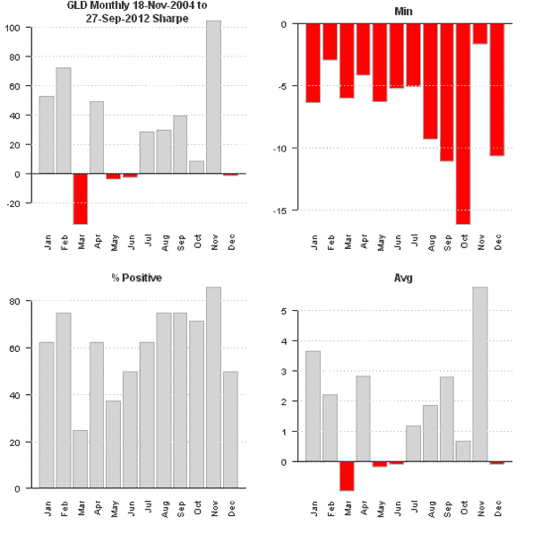
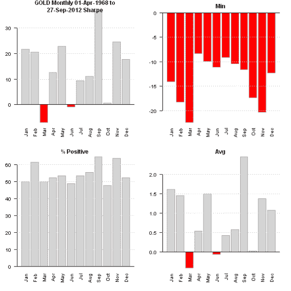

<!--yml
category: 未分类
date: 2024-05-18 14:37:06
-->

# Weekend Reading – Gold in October | Systematic Investor

> 来源：[https://systematicinvestor.wordpress.com/2012/09/29/weekend-reading-gold-in-october/#0001-01-01](https://systematicinvestor.wordpress.com/2012/09/29/weekend-reading-gold-in-october/#0001-01-01)

[Home](https://systematicinvestor.wordpress.com/ "Go to homepage")

>

[R](https://systematicinvestor.wordpress.com/category/r/)

> Weekend Reading – Gold in October

## Weekend Reading – Gold in October

I recently came across the [“An early Halloween for gold traders”](http://www.marketwatch.com/story/an-early-halloween-for-gold-traders-2012-09-26) article by Mark Hulbert. I have discussed this type of seasonality analysis in [my presentation at R/Finance](https://systematicinvestor.wordpress.com/2012/05/15/rfinance-2012-presentation/) this year.

It is very easy to run the seasonality analysis using the [Systematic Investor Toolbox](https://systematicinvestor.wordpress.com/systematic-investor-toolbox/).

```

###############################################################################
# Load Systematic Investor Toolbox (SIT)
# https://systematicinvestor.wordpress.com/systematic-investor-toolbox/
###############################################################################
setInternet2(TRUE)
con = gzcon(url('http://www.systematicportfolio.com/sit.gz', 'rb'))
    source(con)
close(con)

    #*****************************************************************
    # Load historical data
    #****************************************************************** 
    load.packages('quantmod')
    ticker = 'GLD'

    data = getSymbols(ticker, src = 'yahoo', from = '1970-01-01', auto.assign = F)
        data = adjustOHLC(data, use.Adjusted=T)

    #*****************************************************************
    # Look at the Month of the Year Seasonality
    #****************************************************************** 
    month.year.seasonality(data, ticker)

```

[](https://systematicinvestor.wordpress.com/wp-content/uploads/2012/09/plot1-small3.png)

This confirms that October have been historically bad for Gold, but we used only 8 years of history because GLD only started traded in 2004.

To get a more complete picture, there is a long history of Gold prices at the [Bundes Bank](http://www.bundesbank.de/Navigation/EN/Statistics/Time_series_databases/Macro_economic_time_series/its_list_node.html?listId=www_s331_b01015_3). I found this data source used at the [Wikiposit](http://wikiposit.org/w?filter=Finance/Commodities/).

I created a helper function [bundes.bank.data.gold() function in data.r at github](https://github.com/systematicinvestor/SIT/blob/master/R/data.r) to download prices from the [Bundes Bank](http://www.bundesbank.de/Navigation/EN/Statistics/Time_series_databases/Macro_economic_time_series/its_list_node.html?listId=www_s331_b01015_3) site.

```

    #*****************************************************************
    # Load long series of gold prices from Bundes Bank
    #****************************************************************** 
    data = bundes.bank.data.gold()

    #*****************************************************************
    # Look at the Month of the Year Seasonality
    #****************************************************************** 
    month.year.seasonality(data, 'GOLD', lookback.len = nrow(data))

```

[](https://systematicinvestor.wordpress.com/wp-content/uploads/2012/09/plot2-small2.png)

The October have been historically bad for Gold using longer time series as well.

Next I would recommend looking at the daily Gold’s performance in October to get a better picture. You might want to use the [Seasonality Tool](http://www.systematicportfolio.com/tools) for this purpose. Please read the [Historical Seasonality Analysis: What company in DOW 30 is likely to do well in January?](https://systematicinvestor.wordpress.com/2011/12/30/historical-seasonality-analysis-what-company-in-dow-30-is-likely-to-do-well-in-january/) post for a case study on how to use the [Seasonality Tool](http://www.systematicportfolio.com/tools).

To view the complete source code for this example, please have a look at the [bt.october.gold.test() function in bt.test.r at github](https://github.com/systematicinvestor/SIT/blob/master/R/bt.test.r).