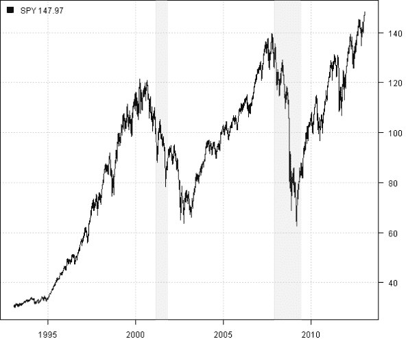

<!--yml
category: 未分类
date: 2024-05-18 14:34:33
-->

# Weekend Reading – S&P 500 Visual History | Systematic Investor

> 来源：[https://systematicinvestor.wordpress.com/2013/01/20/weekend-reading-sp-500-visual-history/#0001-01-01](https://systematicinvestor.wordpress.com/2013/01/20/weekend-reading-sp-500-visual-history/#0001-01-01)

[Home](https://systematicinvestor.wordpress.com/ "Go to homepage")

>

[R](https://systematicinvestor.wordpress.com/category/r/)

> Weekend Reading – S&P 500 Visual History

## Weekend Reading – S&P 500 Visual History

Michael Johnston at the [ETF Database](http://etfdb.com/) shared a very interesting [post](http://etfdb.com/history-of-the-s-and-p-500/) with me over the holidays. The [S&P 500 Visual History](http://etfdb.com/history-of-the-s-and-p-500/) – is an interactive post that shows the top 10 components in the S&P 500 each year, going back to 1980\.

On a different note, Judson Bishop contributed a plota.recession() function to add recession bars to the existing plot. The Recession dates are from [National Bureau of Economic Research](http://www.nber.org/cycles.html). Following is a simple example of plota.recession() function.

```

###############################################################################
# Load Systematic Investor Toolbox (SIT)
# https://systematicinvestor.wordpress.com/systematic-investor-toolbox/
###############################################################################
setInternet2(TRUE)
con = gzcon(url('http://www.systematicportfolio.com/sit.gz', 'rb'))
    source(con)
close(con)

	#*****************************************************************
	# Load historical data for ETFs
	#****************************************************************** 
	load.packages('quantmod')
	SPY = getSymbols('SPY', auto.assign = F)

	#*****************************************************************
	# Create Clusters
	#****************************************************************** 	
 	plota(SPY, type='l')
 		plota.recession()
 	plota.legend('SPY','black',SPY)

```

[](https://systematicinvestor.wordpress.com/wp-content/uploads/2013/01/plot12.png)