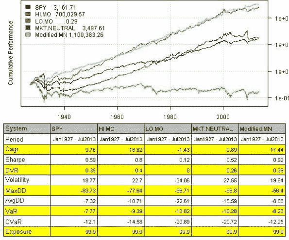

<!--yml
category: 未分类
date: 2024-05-18 14:31:46
-->

# Weekend Reading: Market Neutral | Systematic Investor

> 来源：[https://systematicinvestor.wordpress.com/2013/11/02/weekend-reading-market-neutral/#0001-01-01](https://systematicinvestor.wordpress.com/2013/11/02/weekend-reading-market-neutral/#0001-01-01)

[Home](https://systematicinvestor.wordpress.com/ "Go to homepage")

>

[Backtesting](https://systematicinvestor.wordpress.com/category/backtesting/)

,

[Portfolio Construction](https://systematicinvestor.wordpress.com/category/portfolio-construction/)

,

[R](https://systematicinvestor.wordpress.com/category/r/)

> Weekend Reading: Market Neutral

## Weekend Reading: Market Neutral

I recently came across a very interesting idea at the [The Problem with Market Neutral (and an Answer)](http://www.mebanefaber.com/2013/10/30/the-problem-with-market-neutral-and-an-answer/) post by Mebane Faber. Today I want to show how you can test such strategy using the [Systematic Investor Toolbox](https://systematicinvestor.wordpress.com/systematic-investor-toolbox/):

```

###############################################################################
# Load Systematic Investor Toolbox (SIT)
# https://systematicinvestor.wordpress.com/systematic-investor-toolbox/
###############################################################################
setInternet2(TRUE)
con = gzcon(url('http://www.systematicportfolio.com/sit.gz', 'rb'))
    source(con)
close(con)

	#*****************************************************************
	# Load historical data
	#******************************************************************    
	load.packages('quantmod')		

	data = new.env()

	# load historical market returns
	temp = get.fama.french.data('F-F_Research_Data_Factors', periodicity = '',download = T, clean = T)
		ret = temp[[1]]$Mkt.RF + temp[[1]]$RF
		price = bt.apply.matrix(ret / 100, function(x) cumprod(1 + x))
	data$SPY = make.stock.xts( price )

	# load historical momentum returns
	temp = get.fama.french.data('10_Portfolios_Prior_12_2', periodicity = '',download = T, clean = T)		
		ret = temp[[1]]
		price = bt.apply.matrix(ret / 100, function(x) cumprod(1 + x))
	data$HI.MO = make.stock.xts( price$High )
	data$LO.MO = make.stock.xts( price$Low )

	# align dates
	bt.prep(data, align='remove.na')

	#*****************************************************************
	# Code Strategies
	#*****************************************************************	
	models = list()

	data$weight[] = NA
		data$weight$SPY[] = 1
	models$SPY = bt.run.share(data, clean.signal=T)

	data$weight[] = NA
		data$weight$HI.MO[] = 1
	models$HI.MO = bt.run.share(data, clean.signal=T)

	data$weight[] = NA
		data$weight$LO.MO[] = 1
	models$LO.MO = bt.run.share(data, clean.signal=T)

	data$weight[] = NA
		data$weight$HI.MO[] = 1
		data$weight$LO.MO[] = -1
	models$MKT.NEUTRAL = bt.run.share(data, clean.signal=F)

	#*****************************************************************
	# Modified MN
	# The modified strategy below starts 100% market neutral, and depending on the drawdown bucket 
	# will reduce the shorts all the way to zero once the market has declined by 50%
	# (in 20% steps for every 10% decline in stocks)
	#*****************************************************************	
	market.drawdown = -100 * compute.drawdown(data$prices$SPY)
		market.drawdown.10.step = 10 * floor(market.drawdown / 10)
		short.allocation = 100 - market.drawdown.10.step * 2
		short.allocation[ short.allocation < 0 ] = 0

	data$weight[] = NA
		data$weight$HI.MO[] = 1
		data$weight$LO.MO[] = -1 * short.allocation / 100
	models$Modified.MN = bt.run.share(data, clean.signal=F)

	#*****************************************************************
	# Create Report
	#*****************************************************************
	strategy.performance.snapshoot(models, T)

```

[](https://systematicinvestor.wordpress.com/wp-content/uploads/2013/11/plot1.jpg)

Mebane thank you very much for sharing this great observation and great strategy that works! I would encourage readers to experiment with idea and share their findings.

If you want to concentrate on the long side, one idea that comes to mind is to start not fully invested say at 90% allocation, and once the market hits say 20% draw-down to invest 100% in expectation of quick recovery.

To view the complete source code for this example, please have a look at the [bt.mebanefaber.modified.mn.test() function in bt.test.r at github](https://github.com/systematicinvestor/SIT/blob/master/R/bt.test.r).