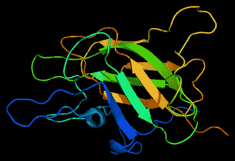
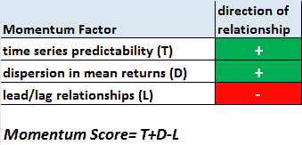
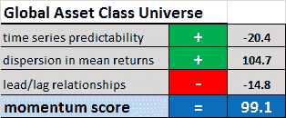
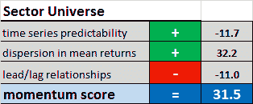
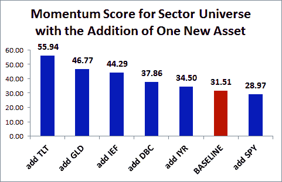

<!--yml
category: 未分类
date: 2024-05-12 17:53:50
-->

# What Factors Drive the Performance of Momentum Strategies? (Part 1) | CSSA

> 来源：[https://cssanalytics.wordpress.com/2014/06/25/what-factors-drive-the-performance-of-momentum-strategies-part-1/#0001-01-01](https://cssanalytics.wordpress.com/2014/06/25/what-factors-drive-the-performance-of-momentum-strategies-part-1/#0001-01-01)

Momentum strategies generate a lot of hype and deservedly so- it is the “premier market anomaly”- a praise heaped by no less a skeptic than Eugene Fama himself. For those who do not know Fama, he happens to be both a founder and ardent proponent of the so-called “Efficient Markets Hypothesis.” The belief in momentum as a legitimate market anomaly has no less fervor in financial circles than organized religion. Doubt its existence and you are akin to a quack or relegated to amateur status among the experienced.

But any real scientist worth their salt should always question “why?” if only to gain a better understanding of the phenomenon. This is not just academic, it is also a practical matter for those who trade with real money. A deeper analysis of the drivers of momentum performance and the conditions in which it can exist can reveal the potential for superior strategies. There have been several landmark papers which shed light on this issue that have no doubt been forgotten or ignored due to their technical nature. For example Lo and MacKinlay ([When Are Contrarian Profits Due to Stock Market Overreaction](http://www.finance.martinsewell.com/stylized-facts/dependence/LoMacKinlay1990.pdf)) and Conrad and Kaul ([An Anatomy of Trading Strategies](http://www.eco.sdu.edu.cn/jrtzx/uploadfile/pdf/empiricalfinance/55.pdf)). The arguments and evidence put forth in these articles help to reconcile how Mr. Fama can both believe in Efficient Markets and still consider momentum to also exist as a legitimate anomaly at the same time. This isn’t a quirk borne of quantum physics, but rather the implication of some basic math and demonstrated conclusively using simulated financial data.

In a previous post, I presented some ideas and testing related to identifying [superior universes for momentum strategies](https://cssanalytics.wordpress.com/2014/06/04/momentum-strategies-and-universe-selection/ "Momentum Strategies and Universe Selection"). A simple/naaive method of finding the best performing universes through brute force shows promise, but there are pitfalls because that method does not capture the drivers of momentum performance. So lets begin with inverting the basic math introduced by Lo and MacKinlay that describes the favorability of a particular universe for contrarian or mean-reversion strategies. Since momentum is the polar opposite of contrarian, what is good for one is bad for the other. The table below shows the three ingredients that affect momentum performance:

The first factor- time series predictability- relates to how predictable or “auto-correlated” an asset or group of assets is on the basis of whether high (low) past returns predict high (low) future returns. If a universe contains highly predictable assets then a momentum strategy will be better able to exploit measurements of past performance.The second factor- dispersion in mean returns- relates to whether a group of assets have average or mean returns that are likely to be materially different from one another. A heterogeneous universe of assets such as one containing diverse asset classes will have different sources of returns- and hence greater dispersion- than a homogeneous universe such as sectors within a stock index. The final factor- lead/lag relationships- is a measure of the strength of any tendency for certain assets or stocks to lead or lag on another. This tendency can occur for example between large liquid stocks and small illiquid stocks. In this case a positive relationship would imply that if say Coke went up today, then a smaller cola company would go up tomorrow. This is good for contrarian strategies that would buy the smaller cola company and short Coke, but obviously bad for momentum strategies–hence the fact that this factor is negatively related to momentum profits. In summary, the equation shows that a “momentum score” can be formulated by adding the time series predictability factor, the dispersion in means factor and subtracting the lead/lag relationship factor.

Let’s show a tangible example to demonstrate how the math matches up with intuition. I calculate a momentum score using the last five years of data for both a diverse asset class universe (SPY,DBC,GLD,TLT,IEF,RWX,IYR,EEM,EWJ,IEV) and also a sector universe (XLE,XLU,XLP,XLB,XLV,XLF,XLK,XLY,XLI). Note that the last five years covers a bull market which would easily obscure comparisons based on just back-testing momentum strategy performance on each universe. The momentum score (higher is better) is broken down by contribution in each table for the two different universes.

Clearly the asset class universe is considered to be superior to just using a sector universe for momentum strategies. This certainly jives with intuition and also empirical performance. But what is more interesting is looking at the largest contribution to the difference between the two universes. We see that the dispersion in the means or variation in cross-sectional average returns is by far the biggest factor that separates an asset class universe from a sector universe. The other two factors practically cancel each other out. This makes sense since most sector returns share a dominant common factor– the return of the stock market or say the return of the S&P500\. When the market is up (or down), most sectors are up (or down) to a greater or lesser extent. In contrast, in an asset class universe you could have a lot more variation- stocks could be up, bonds could be down and commodities could be up. The variation in performance is far more substantial. Note that variation in performance or dispersion in means is not equivalent to correlations which measure the scaled relationship between shorter-term returns. Having a universe with low cross-correlations is not a good proxy for this effect. To better demonstrate the effect of adding variation, lets look at how adding different assets to the sector universe individually can change the momentum score:

Simply adding long-term bonds (TLT) nearly doubles the momentum score versus the baseline of using just the sectors. On the flip side adding the dominant common factor- the S&P500 (SPY)- reduces the momentum score versus the baseline. Adding Gold is actually superior to adding 10-year/Intermediate Treasurys (IEF) which is typically used to proxy the bond component in most portfolios- despite the fact that the correlation of IEF is far more negative than GLD. Using this analysis can provide some very interesting and sometimes counter-intuitive insights (though most make intuitive sense). But more practically, it can be used to create good universes to apply momentum strategies or any other strategy that derives a large chunk of its returns from the momentum effect. In the next post we will clarify why Mr. Fama can both believe in efficient markets and in momentum as an anomaly and also provide some interesting implications and further analysis.