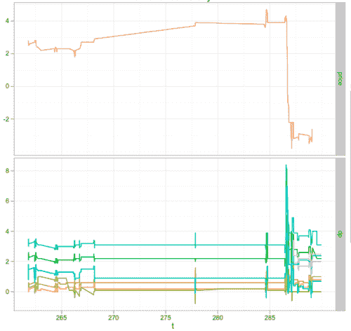
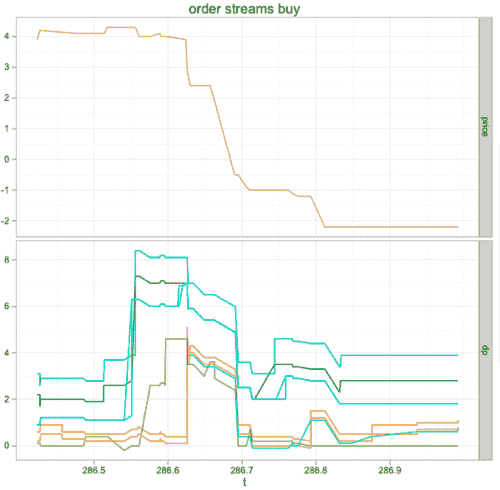

<!--yml
category: 未分类
date: 2024-05-18 15:30:31
-->

# What you don’t know … | Tr8dr

> 来源：[https://tr8dr.wordpress.com/2011/02/17/what-you-dont-know/#0001-01-01](https://tr8dr.wordpress.com/2011/02/17/what-you-dont-know/#0001-01-01)

February 17, 2011 · 12:29 pm

Sometimes there are precipitous drops (or ascents) in price over a very short period in the market.   Over a short period,  momentum analysis from prices or order flow, is not going to allow one to avoid becoming a casualty — Unless, you have  up-front information or lower-latency access to the event source than most participants.

However, when it comes to information impacting intra-day FX, it is disproportionately known to a small # of players:

1.  large market makers (such as banks in the FX market) have access to significant flow and therefore can have a read on supply and demand for a given asset.
2.  banks also know who their trading-counterparts (customers) are and whether the customer is “smart”,  tending to trade ahead of movements.  They also have a good view on how much size is traded over what period.  This is valuable information that they can piggyback on.

The small HF hedge fund participates on the anonymous venues without access to either of these.    Now a fund may have better models, but still lacks a direct view of the market flows as indicated above.    Whether it be large-flow houses or smart hedge funds, some smaller % of orders represent “smart” or in-the-know money and the larger % will tend to be more reactive.

## A Drop

Here is an example of a ~10 pip drop that occurred over a period of 200ms:

The bottom pane contains order-streams for a few bid-side orders of interest in this discussion.   **dp** is expressed in distance from the inside price (for the bid side this means a larger DP means a lower order price).   By order-streams, referring to implicit cancel/replace activity by a trader (algo).

Notice that the orders have been moved deeper into the book (as seen by a spike in **dp**) as a defensive move against a falling price.  Looking more closely, this set of orders actually made the move **before** the drop (aha, “smart” algo working here).

Notice that four of the order streams (green – blue) moved orders deeper into the book ~60ms before the drop and the other colors a ms or 2 before drop but in-time to avoid a fill.

## Conclusion

If you don’t have early access to information, look for a participant who does and use appropriately.   This is easier said than done, however. Detecting participants (i.e. order-streams) and determining whether they are “smart” or “dumb” is not straightforward.   I will touch on some of the related problems in a later post, but unfortunately cannot discuss everything in detail.