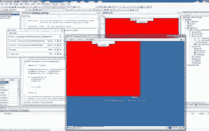

<!--yml
category: 未分类
date: 2024-05-18 06:14:25
-->

# Windows Embedded Compact 7 Lost? | Tales from a Trading Desk

> 来源：[https://mdavey.wordpress.com/2010/08/09/windows-embedded-compact-7-lost/#0001-01-01](https://mdavey.wordpress.com/2010/08/09/windows-embedded-compact-7-lost/#0001-01-01)

## Windows Embedded Compact 7 Lost?

Is all already lost for Windows Embedded Compact 7 with Asus [EeePad](http://www.ubergizmo.com/15/archives/2010/07/asus_eeepad_to_run_on_android_and_not_windows_ce.html) move to Android rather than Windows [CE](http://www.microsoft.com/windowsembedded/en-us/products/windowsce/compact7.mspx), coupled with the fact that “Silverlight for Windows Embedded is a native code (C++) UI framework”? Why did Microsoft not following in the footsteps of Windows [Phone](http://www.windowsphone7.com/) 7 ([built](http://wmpoweruser.com/microsoft-finally-confirms-windows-phone-7-runs-on-windows-ce-7/) on Windows CE 7 kernel) for the tablet world and offer Silverlight from .NET (managed)?

~ by mdavey on August 9, 2010.

Posted in [Uncategorized](https://mdavey.wordpress.com/category/uncategorized/)
Tags: [Microsoft](https://mdavey.wordpress.com/tag/microsoft/)