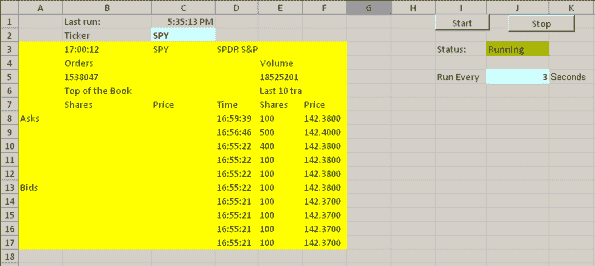

<!--yml
category: 未分类
date: 2024-05-18 14:35:22
-->

# XLLoop examples | Systematic Investor

> 来源：[https://systematicinvestor.wordpress.com/2012/12/11/xlloop-examples/#0001-01-01](https://systematicinvestor.wordpress.com/2012/12/11/xlloop-examples/#0001-01-01)

Today I want to follow up with the XLLoop framework post. Please read the XLLoop framework post first to setup the [XLLoop](http://xlloop.sourceforge.net/) before trying the examples below.

My first example is based on the [TFX Package](https://systematicinvestor.wordpress.com/2012/12/06/tfx-package/) – to retrieve real-time FX quotes. To try this example, please first install the [TFX Package](http://cran.r-project.org/web/packages/TFX/index.html). Please note that you would need R (>= 2.15.0) to run [TFX](http://cran.r-project.org/web/packages/TFX/index.html).

```

# TFX : R (>= 2.15.0)
install.packages(c('XML','bitops','TFX'), repos = 'http://cran.r-project.org', dependencies = 'Imports')

```

Next, let’s create a function to retrieve real-time FX quotes.

```

# http://rpubs.com/gsee/TFX
# https://gist.github.com/4122626
getFX <- function() {
	require(TFX)
	qtf <- QueryTrueFX()
	qtf$TimeStamp <- as.character(qtf$TimeStamp)
	names(qtf)[6] <- "TimeStamp (GMT)"
	qtf[, c(6, 1:3, 5:4)]
}

```

Finally, you will need to add getFX() function to the rstart.r script. For this, I created a user.r file to hold all user functions that you want to be available in Excel and added source(“user.R”) to rstart.r script to load our functions. I have updated the [xlloop-basic.zip](http://www.systematicportfolio.com/xlloop-basic.zip) archive with this new functionality.

At this point you might download [xlloop-basic.zip](http://www.systematicportfolio.com/xlloop-basic.zip) archive and follow the steps in the XLLoop framework post to setup the [XLLoop](http://xlloop.sourceforge.net/). Next, play with xlloop_TFX.xls

If all works well, you will see following Excel spreadsheet that will update every 3 seconds. You can stop/start updating by clicking Stop/Start buttons. You can also change the speed of updates by entering a different number in cell J5.

[](https://systematicinvestor.wordpress.com/2012/12/11/xlloop-examples/plot1-png-small-67/)

Another example that I want to share today will retrieve real-time stock quotes from [BATS Exchange](http://www.batstrading.com/book/SPY/). Please first install the [RJSONIO Package](http://cran.r-project.org/web/packages/RJSONIO/index.html):

```

install.packages('RJSONIO', repos = 'http://cran.r-project.org', dependencies = 'Imports')

```

Next, let’s create a function to retrieve real-time stock quotes.

```

#=FS("bats.quote","IBM")
# http://www.batstrading.com/book/IBM/
bats.quote <- function(ticker) {
	require(RJSONIO)

	url = paste('http://www.batstrading.com/json/bzx/book/', ticker, sep = '')
	x = fromJSON(url)

	# create output
	out = matrix('', 15,6)
	out[1,2] = x$data$timestamp
	out[1,3] = x$data$symbol
	out[1,4] = x$data$company

	out[2,2] = 'Orders'
	out[2,5] = 'Volume'
	out[3,2] = x$data$orders
	out[3,5] = x$data$volume

	out[4,2] = 'Top of the Book'
	out[4,5] = paste('Last', length(x$data$trades), 'trades')

	out[5,] = c('','Shares','Price','Time','Shares','Price')

	out[6,1] = 'Asks'
	if(length(x$data$asks) > 0) out[6:10,2:3] = t(sapply(x$data$asks, unlist))
	out[11,1] = 'Bids'
	if(length(x$data$bids) > 0) out[11:15,2:3] = t(sapply(x$data$bids, unlist))

	if(length(x$data$trades) > 0) out[6:15,4:6] = t(sapply(x$data$trades, unlist))

	out
}

```

I have added bats.quote() to a user.r file in the [xlloop-basic.zip](http://www.systematicportfolio.com/xlloop-basic.zip) archive for this example. Next, play with xlloop_BATS.xls

If all works well, you will see following Excel spreadsheet that will update every 3 seconds. You can stop/start updating by clicking Stop/Start buttons. You can also change the speed of updates by entering a different number in cell J5\. You can also change the company by entering a different ticker in cell C2.

[](https://systematicinvestor.wordpress.com/2012/12/11/xlloop-examples/plot2-png-small-64/)

Please let me know what problems you run into while experimenting with these examples.

I have noticed that FX quotes on my system do not update as often as I would expect.