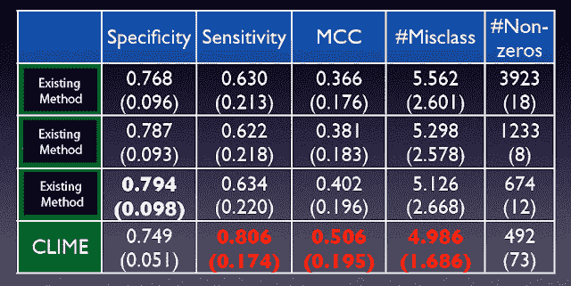

<!--yml
category: 未分类
date: 2024-05-18 14:06:19
-->

# Xi (Rossi) LUO: Genetic Profiling for Breast Cancer Treatment

> 来源：[http://rossiluo.blogspot.com/2012/03/genetic-profiling-for-breast-cancer.html#0001-01-01](http://rossiluo.blogspot.com/2012/03/genetic-profiling-for-breast-cancer.html#0001-01-01)

Our paper,

[CLIME](http://pubs.amstat.org/doi/abs/10.1198/jasa.2011.tm10155)

, appeared in Journal of the American Statistical Association last year.  It is always amazing to me that how science can help shape the future.  Part of the paper employed a mathematical model to study if we can predict the outcome of a breast cancer patient based on her genetic profile.  The prediction performance is interestingly good.

|  |
| Average (SD) performance of classifying breast cancer treatment outcomes over 100 out-of-sample runs. |

Both the sensitivity and specificity are high (>=75%).  The R package for the CLIME method is

[here](http://cran.r-project.org/web/packages/clime/index.html)

on CRAN, and I will provide an update very soon.