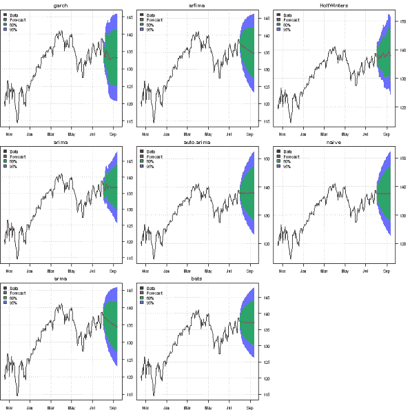

<!--yml
category: 未分类
date: 2024-05-18 14:39:01
-->

# Yet Another Forecast Dashboard | Systematic Investor

> 来源：[https://systematicinvestor.wordpress.com/2012/07/31/yet-another-forecast-dashboard/#0001-01-01](https://systematicinvestor.wordpress.com/2012/07/31/yet-another-forecast-dashboard/#0001-01-01)

Recently, I came across quite a few examples of time series forecasting using R. Here are some examples:

So I have decided to roll my own version of Forecast Dashboard as well. First, let’s define some helper functions:

```

###############################################################################
# Load Systematic Investor Toolbox (SIT)
# https://systematicinvestor.wordpress.com/systematic-investor-toolbox/
###############################################################################
setInternet2(TRUE)
con = gzcon(url('http://www.systematicportfolio.com/sit.gz', 'rb'))
    source(con)
close(con)

# extract forecast info
forecast.helper <- function(fit, h=10, level = c(80,95)) {
	out = try(forecast(fit, h=h, level=level), silent=TRUE)
	if (class(out)[1] != 'try-error') {
		out = data.frame(out)
	} else {
		temp = data.frame(predict(fit, n.ahead=h, doplot=F))
			pred = temp[,1]
			se = temp[,2]
		qq = qnorm(0.5 * (1 + level/100))
		out = matrix(NA, nr=h, nc=1+2*len(qq))
			out[,1] = pred
		for(i in 1:len(qq))
			out[,(2*i):(2*i+1)] = c(pred - qq[i] * se, pred + qq[i] * se)
		colnames(out) = c('Point.Forecast', matrix(c(paste('Lo', level, sep='.'), paste('Hi', level, sep='.')), nr=2, byrow=T))
		out = data.frame(out)
	}	
	return(out)
}

# compute future dates for the forecast
forecast2xts <- function(data, forecast) {
	# length of the forecast
	h = nrow(forecast)
	dates = as.Date(index(data))

	new.dates = seq(last(dates)+1, last(dates) + 2*365, by='day')
	rm.index = date.dayofweek(new.dates) == 6 | date.dayofweek(new.dates) == 0
 	new.dates = new.dates[!rm.index]

 	new.dates = new.dates[1:h] 	
 	return(make.xts(forecast, new.dates))
}

# create forecast plot
forecast.plot <- function(data, forecast, ...) {
	out = forecast2xts(data, forecast)

 	# create plot
 	plota(c(data, out[,1]*NA), type='l', 
 			ylim = range(data,out,na.rm=T), ...) 		

 	# highligh sections
	new.dates = index(out)
		temp = coredata(out)

	n = (ncol(out) %/% 2)
	for(i in n : 1) {
		polygon(c(new.dates,rev(new.dates)), 
			c(temp[,(2*i)], rev(temp[,(2*i+1)])), 
		border=NA, col=col.add.alpha(i+2,150))
	}

	plota.lines(out[,1], col='red')

	labels = c('Data,Forecast', paste(gsub('Lo.', '', colnames(out)[2*(1:n)]), '%', sep=''))
	plota.legend(labels, fill = c('black,red',col.add.alpha((1:n)+2, 150)))			
}

```

Now we are ready to fit time series models and create a sample Forecast Dashboard. Below are some examples:

```

	#*****************************************************************
	# Create models
	#****************************************************************** 
	load.packages('forecast,fGarch,fArma')

	sample = last(data$prices$SPY, 200)	
	ts.sample = ts(sample, frequency = 12)

	models = list(
		# fGarch		
		garch = garchFit(~arma(1,15)+garch(1,1), data=sample, trace=F),
		# fArma
		arima = armaFit(~ arima(1, 1, 15), data=ts.sample),

		# forecast
		arma = Arima(ts.sample, c(1,0,1)),
		arfima = arfima(ts.sample),
		auto.arima = auto.arima(ts.sample),

		bats = bats(ts.sample),
		HoltWinters = HoltWinters(ts.sample),
		naive = Arima(ts.sample, c(0,1,0))
	)

	#*****************************************************************
	# Create Report
	#****************************************************************** 						
	# 30 day forecast with 80% and 95% confidence bands
		layout(matrix(1:9,nr=3))
		for(i in 1:len(models)) {
			out = forecast.helper(models[[i]], 30, level = c(80,95))	 	
			forecast.plot(sample, out, main = names(models)[i]) 	
		}	

	# 30 day forecast with 75%,85%,95%,97%, and 99% confidence bands
		layout(matrix(1:9,nr=3))
		for(i in 1:len(models)) {
			out = forecast.helper(models[[i]], 30, level = c(75,85,95,97,99))	 	
			forecast.plot(sample, out, main = names(models)[i]) 	
		}	

```

[](https://systematicinvestor.wordpress.com/wp-content/uploads/2012/07/plot1.png)

[](https://systematicinvestor.wordpress.com/wp-content/uploads/2012/07/plot2.png)

I encourage you to read more about various time series models available in R and share your examples of Forecast Dashboards.

To view the complete source code for this example, please have a look at the [bt.forecast.dashboard() function in bt.test.r at github](https://github.com/systematicinvestor/SIT/blob/master/R/bt.test.r).