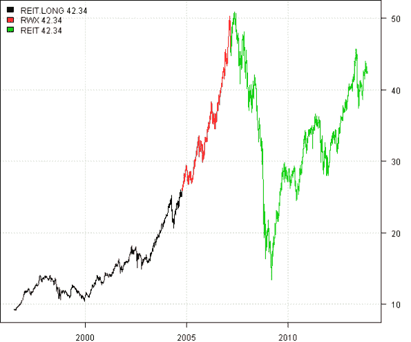
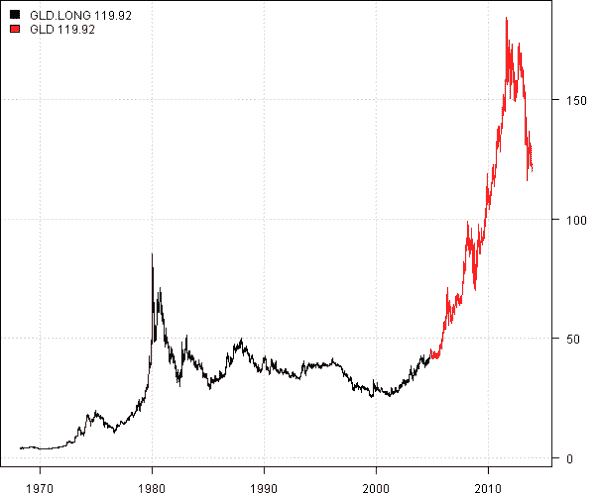

<!--yml
category: 未分类
date: 2024-05-18 14:31:29
-->

# getSymbols Extra | Systematic Investor

> 来源：[https://systematicinvestor.wordpress.com/2013/11/26/getsymbols-extra/#0001-01-01](https://systematicinvestor.wordpress.com/2013/11/26/getsymbols-extra/#0001-01-01)

The [getSymbols](http://www.quantmod.com/documentation/getSymbols.html) function from the quantmod package is an easy and convenient way to bring historical stock prices into your R environment. You need to specify the list of tickers, the source of historical prices and dates. For example following commands will download historical stock prices from yahoo finance for ‘RWX’, ‘VNQ’, ‘VGSIX’ symbols:

```

	data <- new.env()
	getSymbols.extra(c('RWX','VNQ','VGSIX'), src = 'yahoo', from = '1980-01-01', env = data, auto.assign = T)

```

Now, the **data** environment contains the historical stock prices. For example, create plot for RWX using the code below:

```

	plot(data$RWX)

```

Sometimes, I find that [getSymbols](http://www.quantmod.com/documentation/getSymbols.html) functionality can be extended. For example, it would be nice to rename the series. I.e. RWX is a real estate ETF, so we could ask [getSymbols](http://www.quantmod.com/documentation/getSymbols.html) function to get RWX, but call output Real.Estate. Another useful feature would be ability to specify how to extend the data. I.e. RWX is only started trading in 2007, it would be convenient to extend RWX time series with VNQ and VGSIX.

I created the [getSymbols.extra](https://github.com/systematicinvestor/SIT/blob/master/R/utils.r) function to address these features. The [getSymbols.extra](https://github.com/systematicinvestor/SIT/blob/master/R/utils.r) function allows you to specify tickers in the following format:

*   RWX : the original functionality. i.e get historical stock prices for RWX and it can be accessed with data$RWX
*   Real.Estate = RWX : get historical stock prices for RWX, rename it to Real.Estate, and it can be accessed with data$Real.Estate
*   RWX + VNQ + VGSIX : get historical stock prices for RWX, VNQ, VGSIX and extend RWX with VNQ, next extend it with VGSIX, and it can be accessed with data$RWX
*   Real.Estate = RWX + VNQ + VGSIX : mix and match above functionality

Let’s look at the example:

```

###############################################################################
# Load Systematic Investor Toolbox (SIT)
# https://systematicinvestor.wordpress.com/systematic-investor-toolbox/
###############################################################################
setInternet2(TRUE)
con = gzcon(url('http://www.systematicportfolio.com/sit.gz', 'rb'))
    source(con)
close(con)

	tickers = spl('REIT=RWX, RWX+VNQ, REIT.LONG=RWX+VNQ+VGSIX')
	data <- new.env()
		getSymbols.extra(tickers, src = 'yahoo', from = '1980-01-01', env = data, auto.assign = T)
	bt.start.dates(data)

	data$symbolnames = spl('REIT.LONG,RWX,REIT')
		for(i in data$symbolnames) data[[i]] = adjustOHLC(data[[i]], use.Adjusted=T)
	bt.prep(data, align='keep.all') 	

	plota.matplot(data$prices)

```

[](https://systematicinvestor.wordpress.com/wp-content/uploads/2013/11/plot1.png)
The REIT.LONG is RWX extended using VNQ and next using VGSIX.

There is also a possibility to provide custom data into the [getSymbols.extra](https://github.com/systematicinvestor/SIT/blob/master/R/utils.r) function. I.e. the data which is not available through the [getSymbols](http://www.quantmod.com/documentation/getSymbols.html) function.
For example, to extend GLD time series we might used historical Gold prices from Bundes Bank:

```

	# Use extrenal data
	raw.data <- new.env()
		raw.data$GOLD = bundes.bank.data.gold()

	tickers = spl('GLD, GLD.LONG=GLD+GOLD')
	data <- new.env()
		getSymbols.extra(tickers, src = 'yahoo', from = '1980-01-01', env = data, raw.data = raw.data, auto.assign = T)
	bt.start.dates(data)
	data$symbolnames = spl('GLD.LONG,GLD')
   		for(i in data$symbolnames) data[[i]] = adjustOHLC(data[[i]], use.Adjusted=T)
	bt.prep(data, align='keep.all') 	

	plota.matplot(data$prices)	

```

[](https://systematicinvestor.wordpress.com/wp-content/uploads/2013/11/plot2.png)

The main goal of the [getSymbols.extra](https://github.com/systematicinvestor/SIT/blob/master/R/utils.r) function is to simplify your data acquisition/preparation step. Please let me know if you run into any problems or have suggestions.

To view the complete source code for this example, please have a look at the [getSymbols.extra.test() function in utils.r at github](https://github.com/systematicinvestor/SIT/blob/master/R/utils.r).