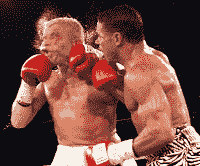

<!--yml
category: 未分类
date: 2024-05-13 00:03:11
-->

# hacking NASDAQ @ 500 FPS: HFT Postmortem - Round 1

> 来源：[http://hackingnasdaq.blogspot.com/2012/05/hft-postmortem-round-1.html#0001-01-01](http://hackingnasdaq.blogspot.com/2012/05/hft-postmortem-round-1.html#0001-01-01)

Its always good to reflect and understand the positive and negative points of a project even for a negative result as you learn the most from your failures than successes... or at least you *should.*

The Round 1 Score

*   1 : NASDAQ
*   0 : Hacking NASDAQ

No KO or TKO with the decision based entirely on points. Kinda sucks ass things haven`t gone as planned but such is life. Lets start with the positive

## What Went Right

Which stands for "Just Fucking Do It". Also known as Analysis Paralysis meaning over thinking and over analyzing the situation to the point where whichever direction you want to go there`s a ton of arguments for it but also against it. 

What happened is I reached the point where the behaviour of the exchange or more precisely the behaviour of my orders to/from/on the exchange became a significant factor in profitability. Thus one of the goals was to test my assumptions on this vs what happens in the real world... which turned out to be very wrong. None the less it is extremely valuable info to know.

2) Real Trading. 

Its all to easy to code up some system, back test it, do whatever feel smug about how much paper money you`ve made...  but is completely different to trading with real money on the real exchange with real consequences if you seriously fuck up. First few weeks were seriously terrifying, what if X happens, what if Y happens what if X causes Y which in turn means I need to liquidate everything I own, move into a tent and beg for change. The reality is if you have multiple independent saftey valves both aggressive and passive there`s not a whole lot that can go wrong and when it does, its not that bad. At this point, I`m quite comfortable running fully automated strategies on the exchange that puts 1000`s of orders  into the book each day.

3) Building Real Trading System.

Learnt alot when building my system. Its one thing to build tools & simulators, completely different to have prod systems that are live and constantly evolving. Ended up writing a bunch of tools adding new components, doing new analysis and quite a few things that are simple but did not anticipate. All very valuable info for Round 2.

4) Watching the Market

Before prod, I almost never looked at what the market did day-to-day, quite oblivious infact as was focusing on historical data. I think your perspective & pattern matching radically changes when your no longer in back test time. When 1 day is say 5 seconds becomes 1 day is 6.5 Hours of up/down/up/down I gained some intuition about how the market moves in the mid-freq time frame. Guess you could say, had no connection to the  market, as it was just numbers and stats - it had no personality.

5) Bite sized Risk

Had a choice of going all out with a significant % of net worth deposit, 5 figure monthly infra costs the hole 9 yards. Or a chunk of change deposit that's a small % of net worth and infra thats good but not on the edge. Chose the latter, my reasoning was have 0 experience trading and I should not risk my current assets on something thats unproven and un-tested. e.g. Do a test first before committing more cash, and I think this was the correct choice.

## What Went Wrong

1) No Strategy

Its kind of a fib to say there were no strategies, perhaps a better wording is had no clearly profitable strategy. The strategies I wanted to run are all highly skewed by the infrastructure/comissions and behaviour of the exchange. So in hindsight the risk was actually very high as the result was highly dependent on a large unknown factor. The end result was after realizing the first batch of strategies wasn't going to work had to start from 0 on a completely different style of trading which there wasn't enough time to get up to speed on.

2) Going it Alone

One of the problems when trading in a bubble is you have no one to bounce ideas off, no one is there to point out the obvious and most importantly no one is there to slap you in the face and say 

*what the fuck man?* 

Self reflection and transitioning between abstraction levels is really hard, especially when you eat/breath/sleep at one level its not easy to step back and look at the wider picture and realize your spending time in the wrong place.

3) Wrong Infrastructure

The infrastructure/commissions was clearly a bad choice for the kinds of strategies I was testing. Yet its hard to say it was wrong given the cost & risk of more appropriate infra. In the end it was just an incorrect matching of strategy and infrastructure, given the goal is to make a profit. If the goal was to understand the exchange / market it was a good choice but.... in the real world one needs to make money.

Theres a bunch of smaller things but I think that summarized the main points.  Round 1 was fun, exciting, learnt an absolute ton but need to re-calibrate before entering the ring again for Round 2.