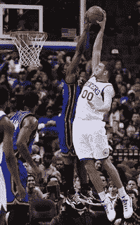

<!--yml
category: 未分类
date: 2024-05-13 00:04:37
-->

# hacking NASDAQ @ 500 FPS: Not loosing, is not winning - transaction costs.

> 来源：[http://hackingnasdaq.blogspot.com/2011/08/not-loosing-is-not-winning-transaction.html#0001-01-01](http://hackingnasdaq.blogspot.com/2011/08/not-loosing-is-not-winning-transaction.html#0001-01-01)

Been a few days since the last post as just hammering away at microstructure strategies which is dam fun but frustrating at times - starting from 0 with nothing/nobody to learn from. Found some nice trigger happy strategies that does *not loose* 90% of the time with Sharpes in the double digits but... there lies the problem, theres 3 states(win, loss, draw) not 2\. A "draw" e.g you correctly predict a 1 tick up/down swing where the spread is 1tick happens 45% of the time with win (> 1tick) the remaining 45%. Meaning you end up with gross 0 PnL for 45% of trades as your just beating the spread. Then accounting for transaction costs puts it into net negative PnL 65% of the time (draw + loose) and thus unprofitable - teh sucks dude.

For reference transaction costs are:
- $0.0045/share (broker fee)
- $0.0030/share (nasdaq remove liquidity fee)

Whats happening? its predicting correct movement very well except that movement is rejected (as in basketball reject) half the time as everyone jumps on the first uptick aka mean-revision and knocks the price down 1 tick. So... need to better classify the rejected jump shots from the high Sharpe slam dunks.

...the expedition continues.