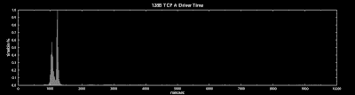
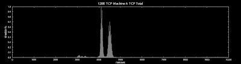
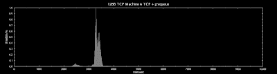
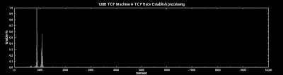

<!--yml
category: 未分类
date: 2024-05-13 00:06:22
-->

# hacking NASDAQ @ 500 FPS: TCP Rx processing

> 来源：[http://hackingnasdaq.blogspot.com/2010/01/tcp-rx-processing.html#0001-01-01](http://hackingnasdaq.blogspot.com/2010/01/tcp-rx-processing.html#0001-01-01)

Previous post looked at things in a more macro level so lets dig a bit deeper into the stack to find out whats going on. We break the plots up in driver / ip / tcp / user and we get the following

TCP 128B round trip total

NIC Driver time

IP processing time

TCP processing time

Kernel -> User switch

Which is the expected result, TCP processing time becomes the bottleneck, but what is it actually doing? Digging down a bit further we get:

TCP top level processing + prequeue

TCP tcp_rcv_established()

Which is rather surprising, it appears the top level processing in tcp_v4_rcv() is where the bulk of the time goes! Not what you expect when tcp_rcv_established() is the main work horse. However.. its gets stranger.

TCP  before prequeue -> tcp_rcv_establish()

Turns out most of the time goes somewhere between pushing the packet onto the tcp prequeue and actually processing it in tcp_rcv_established(). Not sure whats going on there, but surprisingly its where all the action is.