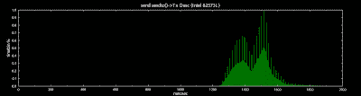
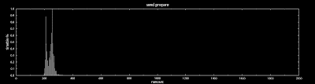
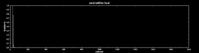
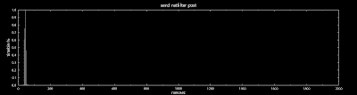
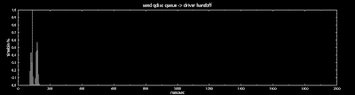
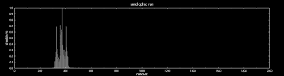
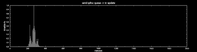
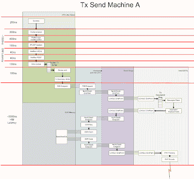

<!--yml
category: 未分类
date: 2024-05-13 00:07:29
-->

# hacking NASDAQ @ 500 FPS: The life and Times of a Tx Packet

> 来源：[http://hackingnasdaq.blogspot.com/2010/01/life-and-times-of-tx-packet.html#0001-01-01](http://hackingnasdaq.blogspot.com/2010/01/life-and-times-of-tx-packet.html#0001-01-01)

Finally.. got some time to spend on this. We got a rough high level view last time on where all the time went, so lets dig a bit deeper into the SW stack to find out what is going on. So.... lets get started using a stock kernel 2.6.30.10, build it, install it, run it  and boom the first plot.

Machine A sendto() -> Tx desc

Which is our toplevel latency reference, of around 1500ns or so from the userlevel function call, to the NIC driver incrementing the Tx Descriptor ring. Not bad, and surprisingly quite a bit faster than our previous tests(2000-3000ns). Why this is, I've no idea, but likely slightly different kernel version and build parameters. Other strange thing is the "shadow graph"**,** possible due to increasing the resolution of our histogram bin size (100ns -> 10ns) **all timing is based on an old 2.6Ghz Xeon**.

Hacking the networking core is a royal pain in the ass, theres no easy module to build, which means rebuilding the kernel and rebooting each time... paaaaaainfully slow dev cycle. But lets start by looking at glibc code, for sendto(), which does basically nothing - invoke a kernel command so first plot is kernel call overhead.

userland -> kernel overhead

Looks around 250ns on average. The double peeks are most likely due to the 2 hardware threads on the machine, so around 700cycles. One side note thats not evident in the plot is, the kernel overhead time drops from about 1200cycles at the start to averaging 700cycles quickly ~ 1000 calls.

The packet then arrives at udp_sendmsg() in the ipv4 udp code, where it does some misc packet header/buffer allocation and a few checks, finds the cached route and acquires a lock on the socket. General house keeping stuff.

kernel socket/packet house keeping

Housekeeping clocks in around the same as the kernel switch, 6-700cycles or about 250ns. After the packets has been checked, its copied into the sockets send buffer - this is what ppl generally think of when discussing socket buffers. Where it it memcpys the packet from userland into kernel space and enbales/maps PCI/DMA access from the NIC.

Userspace -> Kernelspace Packet copy

Histogram is a bit prickly for some reason, possibly due to PCI dma map commands, as the amount of data we:re copying is tiny - 128B and it should be in the L1 and definitely in L2 cache so not sure whats going on there. Its possible the combo of old hardware and un-aligned writes means the CPU is read-modify-write the destination mem cache line, instead of a driect write (no read) thus we pay the latency cost of an uncached memory fetch. Or... its just kernel dma/pci mapping code, not sure.

IP/UDP header write

After the payload is copied, the stack adds the appropriate IP/UDP headers(above) Nothing too interesting here, but is surprising how long it takes, ~150ns which.. is alot. Packet checksums are all offloaded onto the hardware, so its doing something else here.

Now it gets interesting, almost all stock kernel builds have netfilter enabled, to allow packet filter / routing  / firewalls / vpns etc etc - very core usecases for linux. Theres a ton of books and documents on how to use netfilter/ipchains but in our case its entirely pass thru, in fact we should disable netfilter to reduce latency.

netfilter LOCAL passthru

netfilter POST pass thru

As you can see(above) its still quite fast, 80ns or so all up, but think its safe to assume the exchange isnt trying to h4x0r your machine and its all quite un-necessary.

After netfilter approves the packet, its sent to the NIC driver, using another buffering system, qdisc - queuing disciplines. This is MAC level now, typically a single fast priority FIFO per MAC but its completely configurable using the "tc" traffic control command and probably other tools. Qdisc is a powerful system, enabling various buffering, scheduling and filters to be applied but they all add latency, - not particularity helpful  for low latency systems. In fact I intend to completely disable qdisc to reduce latency.

 qdisc packet enqueue

Queing is fairly fast (above) around 130ns or so, the 2nd hump in the histogram is interesting.Guessing its wait time for a atomic lock. Now that our packet is on the queue for eth0, all that's left is for the net scheduler to issue it to the NIC driver. However, there's a nice optimization that after the packet is queued, it immediately attempts to send the packet to the driver, and in this case  usually succeeds The only reason it can fail to immediately send is, if another hardware thread is running the net scheduler thus pushing data to the driver, e.g. we have a small fifo here to avoid dropping packets, but it does add another source of latency.

qdisc queue -> driver xmit

As expected (above), the latency from qdisc queue, to issuing a driver call is  small 100ns or so. Whats interesting is the double spikes, assuming it misses the initial scheduling pass, and hits on the 2nd try.

 NIC driver 1 Tx packet process time

And finally(above) our trusty e1000e NIC driver processing cost, which fills our the Tx descriptor and moves the ring buffer forward. Then frees the packet and is fairly quick to process 400ns. Note, this is the time from driver entry point, to exit point, which is longer than driver entry -> Tx update(below)/hardware hand off, due to cleanup code.

qdisc enqueue -> NIC Tx descriptor write

The question is, if the NIC driver is only taking 3-400ns to kick a Tx descriptor, then the rest of the time must be spent in the  linux kernels networking stack?

 sendto() -> the start of NIC driver handoff

Answer -> yes, most of the time is spent in the kernel.. Plot above shows the entire SW latency excluding the NIC driver where the shape matches the first high level plot (green one) except shifted slightly to the left.  This is good as we have quite a few options to reduce the kernels processing time, to make that packet hit the MAC in < 1,000ns!

typical high level Tx hw/sw flow @ 2.6Ghz old Xeon machine

In summary, the above flow chart shows our current latency estimates. We can only guesstimate the hardware latency due to lack of tools but you can clearly see the HW latency is far greater than the software. As  we are using a typical (old) consumer/server hardware layout thats designed for high throughput NOT ultra low latency. Which is why anyone serious about  ultra low latency... has a very different hardware topology :)