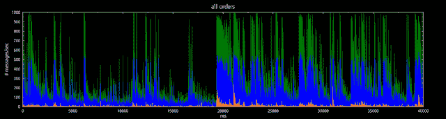

<!--yml
category: 未分类
date: 2024-05-13 00:09:45
-->

# hacking NASDAQ @ 500 FPS: birds eye view

> 来源：[http://hackingnasdaq.blogspot.com/2009/12/message-rate.html#0001-01-01](http://hackingnasdaq.blogspot.com/2009/12/message-rate.html#0001-01-01)

So what kind of message rates is this? For 700M msg / day, its not that interesting, peeking at around 100k messages / second translating to 4100 cycles @ 4.1ghz or 1000ns / message ... which is *alot*. Heres the plot of a single days order add/del/execute/cancel for all symbols. Whats interesting is how spiky it is with some very clear patterns - assuming "time bins" from VWAP / TWAP algos.

Green  = Number of Order deletes

Blue    = Number of Order Adds

Orange = Number of Order Execute

Red     = Number of Order Cancel

1 horz pixel = 1sec of orders

Obviously quote data is an order of magnitude larger than executed trades so breaking out just the order exeuction data looks somthing like (note: vertical scale is an order of magnitude less). Which at a glance dosent have the same cyclic time bins.

1 horz pixel = 1sec of executed orders

Drilling down to get a more mico level view the next shot is sampled every 10ms, e.g. every x pixel is a 10ms slice and runs for about 11minutes. What occurs around the 20000ms mark is quite interesting as it appears some algo gets triggered and a ton of orders flood the market. Keep in mind these are graphs of all symbols, with vertical axis measured in message count NOT aggregate order volume. Whats fascinating is, (i assume)the spikes before 20,000ms are some other algo/symbol/firm(s) and the spikes after is some other algo/symbol/firm(s), in essence a digital signature.

1 horz pixel = 10ms worth of orders

 drilling down further to the 1ms level it gets more chaotic and extracting some signal from the noise gets harder. This chart shows each horizontal pixel as 1ms worth of orders, which is the resolution limit of ITCH3.1 spec. ITCH4 time stamps are at the nanoseccond level so maybe the same picture get clearer with the increased accuracy... or maybe not. The spikey patterns are still faily visible, yet what they represent could be VWAP/TWAP or might even be how the exchange processes orders. Probably the former but none the less its a clear signature of some sort.

1 horz pixel = 1ms worth of orders

Its kind of weird, its like dejavu looking at these graphs, as its similar to the work Ive done with hardware performance trace logic - think a cycle level logic analyizer which dumps out counters every 100ns or so into dedicated ddr/ram. You end up with this massive chunk of data that needs analysis on wtf is going on, and how to improve chip performance - fun stuff.