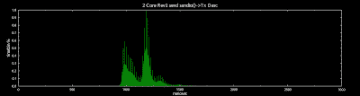
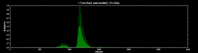
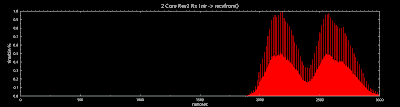
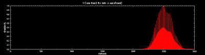
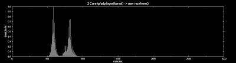
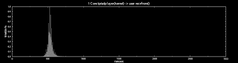

<!--yml
category: 未分类
date: 2024-05-13 00:06:59
-->

# hacking NASDAQ @ 500 FPS: kernel scheduler

> 来源：[http://hackingnasdaq.blogspot.com/2010/01/kernel-scheduler.html#0001-01-01](http://hackingnasdaq.blogspot.com/2010/01/kernel-scheduler.html#0001-01-01)

The double peek in the Rx -> recvfrom() specifically the kernel -> userland switch looked suspiciously like some sort of core/hardware interaction. So, what happens if we change the # cores. Its really simple to do, just add maxcpus=0 to the kernel boot command. And thus the following plots are generated

 

2 Core sendto() -> Tx Desc

 

1 Core sendto() -> Tx Desc

Which is kind of interesting, not sure how/why the 1 Core sendto() has quite a few sample points < 1,000ns where the 2 Core version has none, other than that nothing too exciting.

 

2 Core Rx Intr -> recvfrom()

 

1 Core Rx Intr -> recvfrom()

OTOH receive shows quite a substantial change and as we suspected, it goes from a double peek, to a single peek assumed to be kernel -> userland signaling behaviour.  And ...

2 Core udp finish kernel space -> userspace recvfrom()

 

1 Core udp finish kernel space -> userspace recvfrom()

... the plots speak for them self. Strangely, adding cores in some cases increases latency (the 2nd peek),. No idea whats going on, but keep in mind this is a blocking recvfrom() call so its obviously related to how linux scheduler deals with signals.