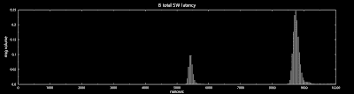

<!--yml
category: 未分类
date: 2024-05-13 00:07:45
-->

# hacking NASDAQ @ 500 FPS: lost in the ether

> 来源：[http://hackingnasdaq.blogspot.com/2010/01/lost-in-ether.html#0001-01-01](http://hackingnasdaq.blogspot.com/2010/01/lost-in-ether.html#0001-01-01)

Ok... so where did that 37,500ns go? I`ve got my suspicions but lets go hack the sauce and get some numbers. First thing to try is any other dials and knobs in the driver, namely:

- disable NAPI

- separate Rx & Tx interrupts

Starting with our baseline from the last post, except using the latest driver from the intel site vs whats in 2.6.30 kernel we get the following plot(below). Did not expect anything major and.. it looks quite similar.

Stock intel 1.1.2 NAPI driver

Next up is to disable NAPI. Resulting in higher CPU loading but potentially lower latency. Plot looks a bit different, but roughly the same, there's some fairly clear changes and the latency increases.. doh.

Disable NAPI

The other builtin knob is, seperate Rx and Tx interrupts, so it uses unique irq`s  per queue instead of shared. Interestingly the histogram`s shape becomes significantly more clear, assuming due to less jitter on interrupt latency.

Disable NAPI, Rx/Tx interrupts separate (+64bx8 header)

Which is all good but has done nothing for total latency, and actually made it worse, so its time to put the rubber gloves on and hack the driver.

While we`re prepping, lets go back and look at whats actually going on. The diagram(left) shows a high level view of the major components we need to test. Namely,

- Machine A Application

- Machine A Kernel + Driver

- Fabric / Ethernet / Hardware

- Machine B Kernel + Driver

- Machine B Application

... and back again.

There`s 2 interesting points in the NIC drive, namely:

- Rx interrupt dispatch

- Tx descriptor write

These events are the first and final contact points between SW and HW. Rx Interrupt dispatch gives a timestamp when the entire sw/os stack is first aware of there is a new UDP packet.

On the other side, Intels network cards use a hardware structure in memory known as a *descriptor* which contains the location, size and a few other attributes about a raw ethernet frame. To send data onto the network the driver builds this structure in a ring buffer, then advances hardware ring buffers position. This advancement tells the hw theres are new descriptors pending, so it can fetch the descriptor(s) + associated memory and eventually push  onto the physical layer/wire. Essentially the hw/sw contact point is when the driver hands off the packet for HW processing.

Using these two events + time stamps at sendto() and recvfrom() we can re-construct a time profile and also look at HW <-> App latency  The timestamps are stored in a, umm... rather rude and amusing way. We added a 64b x 8 header to every ITCH4 message that almost x2 the message size but makes things easy. In the driver, we simply check the UDP header for our magic port number and if it matches, write out the time stamps in unique 64b header slot. Yeah rather nasty.. but this is an holiday hack project - meh..

Ok all the prep is done, so how does it look? Lets follow a single packet in chronological order. First we send the raw ITCH4 packet + header from A in userland.

Latency from Userland -> NIC (Machine A)

Here(above) we see the time it takes from userland sendto() to the driver updating the Tx descriptor ring - full SW latency of sendto(). After this point, the packet journeys across the network fabric from NIC HW + Switch + NIC HW arriving at Machine B`s NIC.

Latency NIC Rx Interrupt -> User Land (Machine B)

After the packet has been decoded by the NIC, it generates an Rx interrupt on Machine B, telling it, there's some data ready. The above plot shows the time between when the Rx interrupt arrives on the CPU, to recvfrom() call returning in userland - full recvfrom() SW latency. Why are there 2 spikes? its not clear. One possible cause is a packet size threshold causes a split code path, and thus the profile into two bins.

Machine B`s user land code is trivial. It sets a header timestamp, then does sendto() of the exact same packet e.g. echo`ing the packet, resulting in the full SW latency from sendto() to NIC  for Machine B.

sendto() -> Tx descriptor update (Machine B)

Again we see these 2 spikes, which hmm... needs investigation. One other thing to notice is  sendto() latency on MachineB is quite a bit slower than MachineA.

After the packet is at Machine B`s NIC, it goes back to the switch, to MachineA`s NIC and generates an Rx interrupt - full recvfrom() SW latency on Machine A (below)

Rx ISR -> recvfrom() (Machine A)

Which is unusually fast, and also a single profile - hmmm... suspicious. In any case we`ve now got everything to fill in the blanks. Whats troubling is we`re a long way off a total latency of 40,000ns! Its good but also bad. So with a few lines of code we get top level MachineA/B full SW latency plots.

Total SW Latency (Machine A)

Total SW latency (Machine B)

Which is Rx+Tx latency for a single packet, and plotting that number on a histogram. Whats really strange is Machine B is *slower* than Machine A, something rather surprising. One possible latency source is is MachineA has 2 HW threads, while Machine B has 8 HW threads. I'm not familiar enough with the linux scheduling algo to know if this changes the profile, but worth checking out.

.... and doing the math you get a plot(below) for fabric time.

Fabric time (NIC->Switch->NIC)

Which is a huge.. huge... chunk of time, say 30,000ns! The good news is, SW latency is around 10,000ns  which is close(ish) to our throughput number of 3,500ns (x3) so we`re 1/3 thoughput/latency.  Seccond good thing is, the GigE switch is a cheap ass old, second hand thing I bought for $100 - 24port, rack mounted GigE, not bad  given the price but aint cisco. Its Corega which is equivelent to Netgear in Asia, does the job, its cheap but your average LAN dosent need sub 10,000ns latency and so the switch is our prime suspect err...... device of interest.