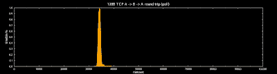
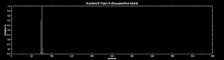

<!--yml
category: 未分类
date: 2024-05-13 00:05:49
-->

# hacking NASDAQ @ 500 FPS: metal to metal

> 来源：[http://hackingnasdaq.blogspot.com/2010/02/metal-to-metal.html#0001-01-01](http://hackingnasdaq.blogspot.com/2010/02/metal-to-metal.html#0001-01-01)

Been busy on some other stuff the last week or so, and time to get back to this. Our last investigation looked into how the stock linux scheduler is responsible for a fair chunk of the network latency we`ve been seeing. Thus the logical question is, what happens if we ditch it all and write to the metal?

Intel hardware is great for this, the hw docs are excellent and reference sauce/linux drivers are nice and easy to follow. Whats the setup? pretty simple, wrote a linux driver which maps BAR0 (register space) and BAR1(flash memory) directly into user space, then allocate and map into the users address space 4 dma buffers, Rx Descriptors, Rx Buffer, Tx Desciptors, Tx Buffer. Which is all we need to write our own PHY/MAC/Ether/IPV4 + ARP/ICMP/UDP/TCP stack. Its a straight forward process, with the only hairy part being the TCP stack. Got everything up and running except TCP in a few days as NIC hardware is pretty dam simple and connection-less protocols are nice and easy. Certainly not production ready but enough to get some interesting results.

Lets start with round trip latency. Its the same 2 machines, we`re using ICMP 64byte payload for this test - note the time scales are different.

64B ICMP round trip (metal)

128B TCP round trip (polling)

Our metal gets on average around 19,000ns for the total round trip, so we can average and say 9,500ns on each side, but it isnt really 50/50 as we shall see. Still while not apples-apples comparison, compared to our best result so far, polling TCP, we are about 15,000ns or so faster than the linux stack, almost x2 nice!

So where does that 19,000ns go? Its quite surprising and actually rather depressing how shite x86 IO architecture is. First the results

 Machine A - latency 1 32b register read

Machine B - latency 1 32b register read

... and as you can see, Machine A takes about 800ns to read 1 register, and Machine B is 2,200ns for *one* read. Why are the 2 machines so different? as discussed before Machine B has its NIC on the PCIe bus, while Machine A is wired directly to the south bridge. Thus while machine B is a fancy pants latest and greatest nehalem and Machine A an old dog, 2007(ish) Xeon, the old dog wins and really drives home the point how important physical hardware topology is at this performance level.

Your regular every day drivers will be interrupt (ish.. NAPI polling) driven, starting with an Rx isr that reads the interrupt status register to work out wtf is going on, then reads the Rx descriptor head register, to see how much/where the new packets are. If we summarize using fancy pants machine B.

MAC -> CPU isr latency : 2,200 / 2 = 1,100ns

CPU isr status register read: 2,200ns

CPU rx desc head register read: 2,200ns

Putting latency at around 5,500ns, that`s *before* protocol processing, and we haven't even looked at the Rx descriptor or Rx buffer data yet!

Machine A Rx Desciptor load(DDR)

Machine B Rx Desciptor load(DDR)

Rx descriptors are in DDR and thankfully can be cached, however the problem is when a device writes into DDR, i beleive, and numbers seem to agree, it invalidates the line(s) from all levels of the cache, which kind of sucks. I kind of expected nehalem would just invalidate the l1/l2, and update the L3, but seems its not that smart Thus in the plots above we see the cost of a l1/l2/l3 miss, so around 100ns/270 cycles on Machine A, and 75ns/200cycles on Machine B. With Machine B faster due to the memory controller being on the CPU instead of the north bridge - one less bus to travel.

In summary 

Wire -> PHY : ?ns

PHY -> MAC : ?ns

MAC -> CPU isr latency : 2,200 / 2 = 1,100ns

CPU isr status register read : 2,200

CPU rx desc head read : 2,200

CPU rx desc read : 75ns

CPU rx buffer read : 75ns

Total: 5,650ns or 15,000 cycles already! Obviously we can pipeline some of this but you wont find that and other optimizations in the standard drivers. Actually on x86, not certain you can issue multiple non cached reads, that are not guarded/serialized e.g. pipelined. Moral of the story, its a challenge to get single digit microsecond latency to turn a trade around (Rx -> Tx), measured from the wire, using standard PC server hardware.