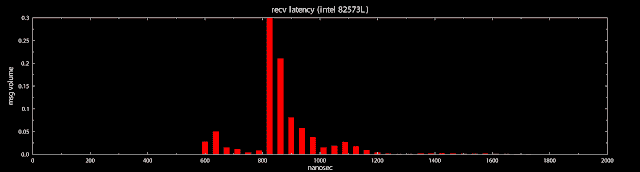

<!--yml
category: 未分类
date: 2024-05-13 00:07:59
-->

# hacking NASDAQ @ 500 FPS: rock on intel

> 来源：[http://hackingnasdaq.blogspot.com/2009/12/rock-on-intel.html#0001-01-01](http://hackingnasdaq.blogspot.com/2009/12/rock-on-intel.html#0001-01-01)

Ok now that all the new year boozing is done, lets get back to it. First up, a new intel NIC was put into Machine B, so we`re now

Machine A (Intel 82573L) Xeon 2.6Ghz

Machine B (Intel 82574L) i7 2.6Ghz

Thus the Machine A is a generation or two behind Machine B in both CPU and NIC but thats what we have to work with.

First up is the Send histograms, in both directions A->B and B->A

Machine A send

Machine B send

As you can see Machine B kicks Machine A`s ass by the tune of say, 5-600ns. How much of this is NIC generation and how much is CPU generation is unclear, no doubt both contribute.

And on the other side, Recv first  B->A and A->B look like(below)

Machine A recv

Machine B recv

And again we see Machine B kicking Machine A`s ass not quite x2 improvement but not far off!.  In anycase it looks far better than the Realtek histograms which were... just abysmal and we`ve now got a baseline to work with.

Next up is looking at the round trip latency meaning A->B->A which assuming the network switch dosent suck(too much.... its old) we should expect around 1300ns(A send) + 500ns(B recv) + 750ns(B send) + 900ns(A recv) totaling in ... around 3450 round trip - quite a long time really.

Lets see what it clocks in as.