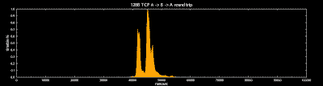

<!--yml
category: 未分类
date: 2024-05-13 00:06:00
-->

# hacking NASDAQ @ 500 FPS: round trip -10us

> 来源：[http://hackingnasdaq.blogspot.com/2010/01/round-trip-10us.html#0001-01-01](http://hackingnasdaq.blogspot.com/2010/01/round-trip-10us.html#0001-01-01)

As we found in the previous post our hypothesis is, most of the latency is in the switch from softirq/tasklet to the callee context aka a scheduler problem. So if this is correct, a polling recv instead of blocking should give  nice speedups, with of course higher cpu usage, meaning your HVAC and power bill goes up.

TCP 128B A->B->A round trip latency. blocking recv() x2

TCP 128B A->B-A round trip latency. polling recv() x2

... and wow, what a difference with just a few lines of code! and confirms we need to hack on the linux scheduler. Final speedup being  around 10,000ns+ so 5,000ns on each side (A recv, B recv) with a very nice, small stddev - woot.

The conventional wisdom is "polling is bad" translating to bad programmer, where your meant to do something fancy/smart as the latency is small. If small means 100us, its a reasonable assumption however 100us isnt small in HFT. Thus for low latency environments,  where we are counting nanoseconds, and theres more cycles/core than you can shake a stick at, you really should be using non-blocking, polling socket loops. Maybe ditch traditional interrupt based device drivers too  :)

... or hack on the kernel scheduler lol