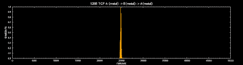
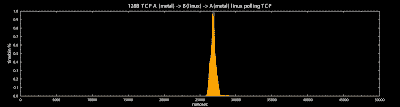

<!--yml
category: 未分类
date: 2024-05-13 00:05:29
-->

# hacking NASDAQ @ 500 FPS: tcp metal

> 来源：[http://hackingnasdaq.blogspot.com/2010/02/tcp-metal.html#0001-01-01](http://hackingnasdaq.blogspot.com/2010/02/tcp-metal.html#0001-01-01)

Quick update on what TCP metal vs linux look like? Our TCP stack is err... not finished but enough is done to get some sort of ballpark numbers.

128B TCP all metal

128B TCP metal->linux->metal

As you can see we`re only just beating out linux here, to the tune of 1-2,000ns - and we`re not even a complete tcp stack yet! Certainly not what I expected but goes to show linux is pretty dam good... or my first pass code is really sucky. So need to slash around 5,000 cycles off our implementation... things finally getting interesting.