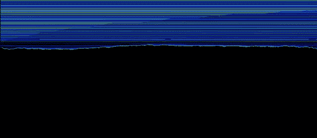
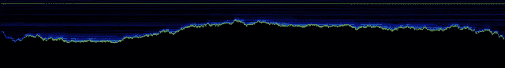

<!--yml
category: 未分类
date: 2024-05-13 00:09:02
-->

# hacking NASDAQ @ 500 FPS: the book

> 来源：[http://hackingnasdaq.blogspot.com/2009/12/book.html#0001-01-01](http://hackingnasdaq.blogspot.com/2009/12/book.html#0001-01-01)

After an order has been distributed to the market, the next step is to build the book, which is simply separation and sorting of orders into the bins of, buy/sell, price level, and order #. The result is a list of buy & sell price levels, with each price level having its own list containing individual orders at that price. Simple stuff, what makes it interesting is the sheer volume and depth of the book. Maybe its buggy but the book depth is about 1.5-2 orders of magnitude larger than what I was expecting. MSFT(2008/11) clocks in on average 500 buy levels, 1500 sell level and about 18K orders on the book at one time. Certainly a different picture on the left, which was my expectation.

So whats up with that? I think the answer is it only shows quotes near the last executed price, or some moving average + standard deviation and thus the order book is nice and small. What does it really look like? Heres the buy order book for MSFT sampled every 10ms, rather beautiful.

 buy book sampled every 10ms. y axis $0 -$30

Note that the coloring is based on order count, at that price level, at that time. Its not symbol volume at the price level Pretty eh? bit like geology. Can see all the dumb arse (near)$0 orders, the various "oh shit sell" price levels(long horz lines) and the edge - where all the action is.

More detailed version shows shows from $18 dollar(bottom left hand corner) on up. Each vertical pixel == 1cent. Not sure what to make of the horizontal black lines. Assume its gaps in the price level or a floating vs fixed point calc thing... tho at these levels it shouldn't be a problem, or just a bug in my code.

from $18 1 vert pixel = $0.01, horz pix = 10ms

And.. it wouldn`t be complete without a sell picture, here`s the same $0-$30 scale. Anything > $30 is capped at $30\. Depending on how you look at it, might be a cave, or mountain in the sunset. Its interesting the number of higher prices (long horz lines) is sufficiently denser than that of the buy book. Guess this is where most of the 500 vs 1500 price levels goes.

sell book vert scale[$0,$30] 1 horz pixel = 10ms

And an obligatory close up on the edge - fascinating stuff.

sell book vert scale from $18 1 vert pixel = $0.01, horz pixel = 10ms