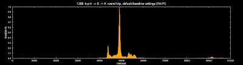

<!--yml
category: 未分类
date: 2024-05-13 00:06:35
-->

# hacking NASDAQ @ 500 FPS: the gap

> 来源：[http://hackingnasdaq.blogspot.com/2010/01/gap.html#0001-01-01](http://hackingnasdaq.blogspot.com/2010/01/gap.html#0001-01-01)

Too much software, too many switchs, too many dials... too much variablility.... how do you make a linux system stable at this timing level? The previous UDP charts were from last weeks tests so what happens if we run the exact same 128B ping-pong with UDP, using the same kernel, same driver, not even a reboot and ...

UDP 128B latency A -> B -> A

TCP 128B latency A -> B -> A

... the numbers pretty closely match our 7,000ns delta, which is roughly the difference seen in the Rx/Ty handlers so we are in the right ball park and it looks good - kind of.